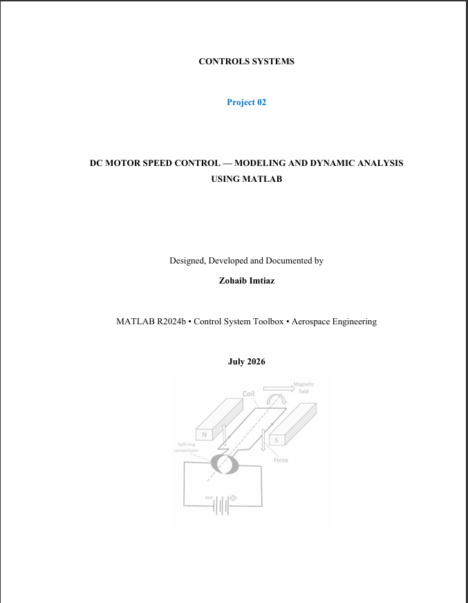

# DC Motor Speed Control — Modeling and Dynamic Analysis Using MATLAB

**Classical Control Systems | MATLAB | Aerospace Engineering**

This repository contains my second independent control systems project, focusing on the mathematical modeling, parameter analysis, and dynamic simulation of an armature-controlled DC motor using MATLAB.

---

## Overview

This project presents a comprehensive open-loop dynamic analysis of a DC motor using MATLAB. Starting from first principles, the governing electrical and mechanical equations were derived using Kirchhoff's Voltage Law and Newton's Rotational Law. A transfer function relating the applied armature voltage to the output angular velocity was then derived by hand and implemented in MATLAB.

The study investigates how the four principal motor parameters — armature resistance, rotor inertia, armature inductance, and viscous friction coefficient — individually affect the transient response, pole locations, and steady-state performance of the motor. A breakaway point phenomenon was discovered experimentally during the pole movement study, connecting directly to root locus theory. Numerical solutions obtained using MATLAB's ODE45 solver were compared with the analytical transfer function response to verify the mathematical model.

---

## Objectives

- Derive the governing electrical and mechanical equations of a DC motor from physical principles
- Apply KVL and Newton's Rotational Law to obtain two coupled differential equations
- Derive the complete transfer function ω(s)/V(s) by hand using Laplace transforms
- Implement the transfer function in MATLAB and analyze the open-loop step and impulse responses
- Investigate how each motor parameter (R, J, L, b) individually affects transient and steady-state behavior
- Discover and explain the breakaway point phenomenon in the pole trajectory
- Verify the transfer function model using the ODE45 numerical solver
- Connect DC motor actuator dynamics to real aerospace engineering applications

---

## System Description

The DC motor consists of two coupled subsystems:

**Electrical Subsystem**
- Armature Resistance R (Ω)
- Armature Inductance L (H)
- Applied Voltage V(t)
- Back-EMF: eb = Ke·ω

**Mechanical Subsystem**
- Rotor Moment of Inertia J (kg·m²)
- Viscous Friction Coefficient b (N·m·s/rad)
- Angular Velocity ω (rad/s)
- Electromagnetic Torque T = Kt·i

---

## Transfer Function

Derived from the governing equations:

```
G(s) = ω(s)/V(s) = Kt / [(Js + b)(Ls + R) + Kt·Ke]
```

Expanded denominator form:

```
G(s) = Kt / [JLs² + (JR + bL)s + (bR + Kt·Ke)]
```

---

## Nominal Parameters

| Parameter | Symbol | Value | Unit |
|---|---|---|---|
| Moment of Inertia | J | 0.01 | kg·m² |
| Viscous Friction | b | 0.1 | N·m·s/rad |
| Armature Resistance | R | 1 | Ω |
| Armature Inductance | L | 0.5 | H |
| Torque Constant | Kt | 0.01 | N·m/A |
| Back-EMF Constant | Ke | 0.01 | V·s/rad |

---

## Features

- Transfer Function Derivation (by hand + MATLAB)
- Step Response Analysis
- Impulse Response Analysis
- Pole Analysis using `pole()`
- Performance Specifications using `stepinfo()`
- Parameter Sensitivity Study (R, J, L, b)
- Breakaway Point Discovery
- Comparative Analysis (R vs b, J vs L)
- ODE45 Numerical Verification
- Aerospace Applications Discussion

---

## Key Findings

**Base Case:**
- Poles at −9.9975 and −2.0025 → overdamped, no overshoot
- Settling time: 2.065 s
- Steady-state speed: 0.0998 rad/s for 1 V input

**Parameter Effects:**
- Increasing R → lower steady-state speed, faster settling (because target is lower)
- Increasing J → same steady-state speed, slower transient
- Increasing L → same steady-state speed, slower transient
- Increasing b → lower steady-state speed, initially slower then faster settling

**Breakaway Points Discovered:**
- R ≈ 5 Ω — poles become complex conjugates
- J ≈ 0.05 kg·m² — poles become complex conjugates
- L ≈ 0.10 H — poles become complex conjugates

**ODE45 Verification:** Both solutions overlap perfectly, confirming model validity.

---

## Aerospace Applications

DC motor actuator dynamics are directly relevant to:
- **Aircraft** — servo motors actuating elevator, aileron, and rudder control surfaces
- **UAVs** — BLDC motors providing thrust and attitude control
- **Satellites** — reaction wheel motors for propellant-free attitude control
- **Rockets** — gimbal actuators for thrust vector control

The open-loop motor cannot track a commanded speed reliably — its final speed depends on parameter values, not the desired setpoint. This is the core motivation for adding a PID controller in Project 03.

---

## Software Used

- MATLAB R2024b
- Control System Toolbox

---

## Future Work

This project forms the foundation for Project 03: PID Speed Controller Design. Planned extensions include:

**Project 03 — PID Controller**
- Closed-loop PID speed controller for the same DC motor
- Manual tuning vs pidtune() comparison
- P, PI, PD, and PID performance comparison
- Simulink closed-loop block diagram

**Later Projects**
- Root locus analysis
- Bode and frequency response analysis
- State-space representation
- LQR optimal controller
- Aircraft pitch control
- UAV attitude stabilization
- Rocket attitude control

---

## Author

**Zohaib Imtiaz**
Aerospace Engineering Student

---


## License

This project is released under the MIT License.

---

## Project Cover




---


